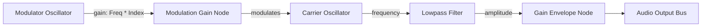

# 16-Bit Chiptunes System Implementation Guide (for GPT-5.5)

This guide documents how the **16-bit retro FM Synthesis chiptune background music system** is designed and implemented in *Grass Touching Simulator*. Use this guide to re-implement or expand the synthesizer, tracks, and UI controls.

---

## 🎹 Architectural Overview

The music system relies on a pure Web Audio API synthesizer that plays procedural chiptune loops without pre-rendered audio files. 

It is divided into three layers:
1. **Types & Save Layer**: Stores the active track ID in the save data (`GameState`).
2. **Audio System Layer (`ChiptuneMusicSystem.ts`)**: Custom Web Audio synthesizer supporting FM (Frequency Modulation) synthesis voices, custom percussion scheduling, and track switching.
3. **UI Layer (`GameScene.ts`)**: A track selector component inside the in-game Options panel.

---

## 🛠️ Step-by-Step Implementation Instructions

### Step 1: Update Game State & Save Persistence

#### A. Add state definition to [src/game/types/game-state.ts](file:///c:/Users/rafbu/OneDrive/Documenten/Grass%20Touching%20Simulator/src/game/types/game-state.ts)
Add `selectedTrackId?: string;` to the `GameState` interface to store the player's active song selection:
```typescript
export interface GameState {
  // Existing state properties...
  selectedTrackId?: string;
  lastSavedAt: number;
}
```

#### B. Initialize default state in [src/game/systems/FieldSystem.ts](file:///c:/Users/rafbu/OneDrive/Documenten/Grass%20Touching%20Simulator/src/game/systems/FieldSystem.ts)
Set the default track to `"cozy_meadow"` inside `createInitialState()`:
```typescript
export function createInitialState(): GameState {
  return {
    // Existing fields...
    selectedTrackId: "cozy_meadow",
    lastSavedAt: Date.now(),
  };
}
```

#### C. Migrate existing saves in [src/game/systems/SaveSystem.ts](file:///c:/Users/rafbu/OneDrive/Documenten/Grass%20Touching%20Simulator/src/game/systems/SaveSystem.ts)
Add migration code in `migrateGameState(saved)` to safely import the selected track:
```typescript
function migrateGameState(saved: Record<string, unknown>): GameState {
  const initial = createInitialState();
  return {
    ...initial,
    // Existing migrations...
    selectedTrackId: typeof saved.selectedTrackId === "string" ? saved.selectedTrackId : initial.selectedTrackId,
    lastSavedAt: readNumber(saved.lastSavedAt, initial.lastSavedAt),
  };
}
```

---

### Step 2: The FM Synthesis Engine & Tracks

The synthesizer in [src/game/systems/ChiptuneMusicSystem.ts](file:///c:/Users/rafbu/OneDrive/Documenten/Grass%20Touching%20Simulator/src/game/systems/ChiptuneMusicSystem.ts) creates Sega Genesis-style FM tones by routing a **modulator oscillator** into the frequency of a **carrier oscillator**:



#### A. Instrument Tone Generator (`playTone`)
Inside `ChiptuneMusicSystem.ts`, `playTone` creates the nodes dynamically. It applies exponential decay to both the amplitude envelope and the modulation index for a pluck/slap effect:
```typescript
private playTone(options: ToneOptions): void {
  if (!this.context || !this.master) return;

  const output = options.output ?? this.dryBus ?? this.master;
  const attack = options.attack ?? 0.01;
  const release = options.release ?? 0.04;
  const peakAt = options.startAt + attack;
  const endAt = options.startAt + options.duration;

  const carrier = this.context.createOscillator();
  const gain = this.context.createGain();
  const filter = this.context.createBiquadFilter();

  carrier.type = options.waveform;
  carrier.frequency.setValueAtTime(options.frequency, options.startAt);

  let modulator: OscillatorNode | undefined;
  let modGain: GainNode | undefined;

  if (options.useFM) {
    modulator = this.context.createOscillator();
    modGain = this.context.createGain();

    const ratio = options.fmRatio ?? 2;
    const index = options.fmIndex ?? 3;

    modulator.frequency.setValueAtTime(options.frequency * ratio, options.startAt);
    modGain.gain.setValueAtTime(options.frequency * index, options.startAt);
    // FM modulation index decay
    modGain.gain.exponentialRampToValueAtTime(options.frequency * index * 0.1 || 0.0001, endAt);

    modulator.connect(modGain);
    modGain.connect(carrier.frequency);
  }

  filter.type = "lowpass";
  filter.frequency.setValueAtTime(options.waveform === "square" ? 2200 : 1800, options.startAt);

  gain.gain.setValueAtTime(0.0001, options.startAt);
  gain.gain.exponentialRampToValueAtTime(options.volume, peakAt);
  gain.gain.exponentialRampToValueAtTime(0.0001, endAt);

  carrier.connect(filter);
  filter.connect(gain);
  gain.connect(output);

  carrier.start(options.startAt);
  carrier.stop(endAt + 0.03);

  if (modulator) {
    modulator.start(options.startAt);
    modulator.stop(endAt + 0.03);
  }
}
```

#### B. Track Struct definition
Each track is structured using the `ChiptuneTrack` interface:
```typescript
export interface ChiptuneTrack {
  id: string;
  name: string;
  bpm: number;
  melodyPhrases: Array<Array<NoteName | null>>;
  counterPhrases: Array<Array<NoteName | null>>;
  chords: ChordShape[];
  waveformLead: Waveform;
  waveformBass: Waveform;
  useFMLead?: boolean;
  useFMBass?: boolean;
  fmRatioLead?: number;
  fmIndexLead?: number;
  fmRatioBass?: number;
  fmIndexBass?: number;
}
```

---

### Step 3: Wire the Options Panel Track Selector

#### A. Add Selector components in [src/game/scenes/GameScene.ts](file:///c:/Users/rafbu/OneDrive/Documenten/Grass%20Touching%20Simulator/src/game/scenes/GameScene.ts)
Define class variables for UI layout:
```typescript
private optionsTrackLabel!: Phaser.GameObjects.Text;
private optionsTrackLeftBtn!: Phaser.GameObjects.Container;
private optionsTrackRightBtn!: Phaser.GameObjects.Container;
```

#### B. Initialize Track on create()
Start the synthesizer using the saved track in `create()`:
```typescript
this.music.setVolume(this.musicVolume);
this.music.setTrack(this.state.selectedTrackId || "cozy_meadow");
```

#### C. Build Selector UI inside `createOptionsPanel()`
Initialize the text label and arrows. Tapping arrow buttons calls `cycleTrack()`:
```typescript
// Resize panel rectangle height from 210 to 280 to fit selector
this.optionsPanel = this.add.rectangle(0, 0, 460, 280, 0xf4ffdc, 0.98);

this.optionsTrackLabel = this.add.text(0, 0, "", {
  fontFamily: "Trebuchet MS, Arial",
  fontSize: "18px",
  color: "#183d20",
}).setOrigin(0.5);

this.optionsTrackLeftBtn = createTextButton(this, "<", () => this.cycleTrack(-1), 44, 38, 111);
this.optionsTrackRightBtn = createTextButton(this, ">", () => this.cycleTrack(1), 44, 38, 111);
```

#### D. Position elements in `layoutOptionsPanel()`
Arrange the track controls dynamically relative to the center of the viewport:
```typescript
const trackLabelY = centerY + 32;
this.optionsTrackLabel.setPosition(centerX, trackLabelY);
this.optionsTrackLeftBtn.setPosition(centerX - 155, trackLabelY - 19);
this.optionsTrackRightBtn.setPosition(centerX + 111, trackLabelY - 19);
```

#### E. Cycle Track and Save BGM Selection
Cycle index, switch synth playback, save state, and update text display:
```typescript
private cycleTrack(direction: number): void {
  const trackIds = ["cozy_meadow", "grasslands_groove", "dreamy_dewdrops", "constellation_climb"];
  const currentIndex = trackIds.indexOf(this.music.getCurrentTrackId());
  let nextIndex = (currentIndex + direction) % trackIds.length;
  if (nextIndex < 0) nextIndex += trackIds.length;

  const nextTrackId = trackIds[nextIndex];
  this.music.setTrack(nextTrackId);
  this.state.selectedTrackId = nextTrackId;
  saveGame(this.state);
  this.refreshOptionsPanel();
}
```
