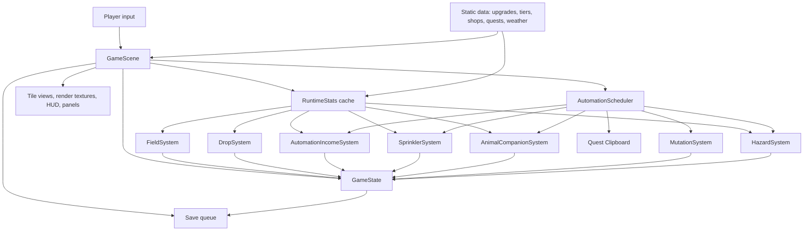
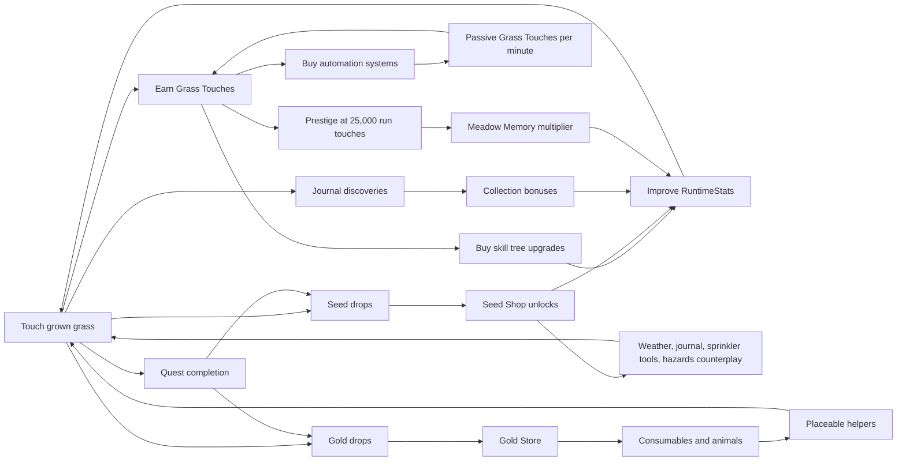
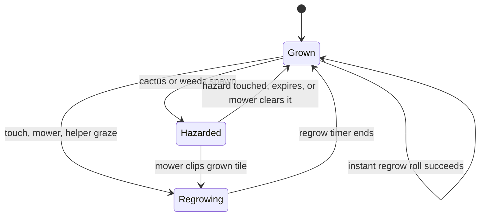
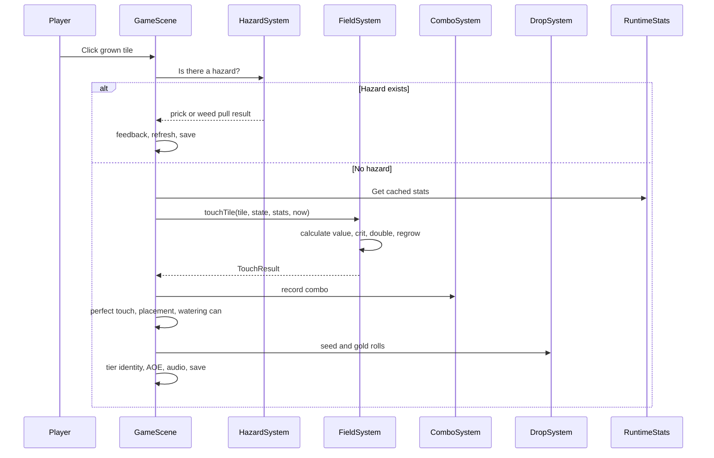
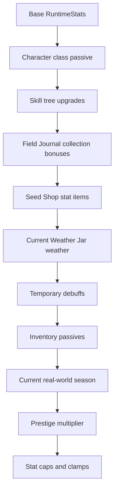
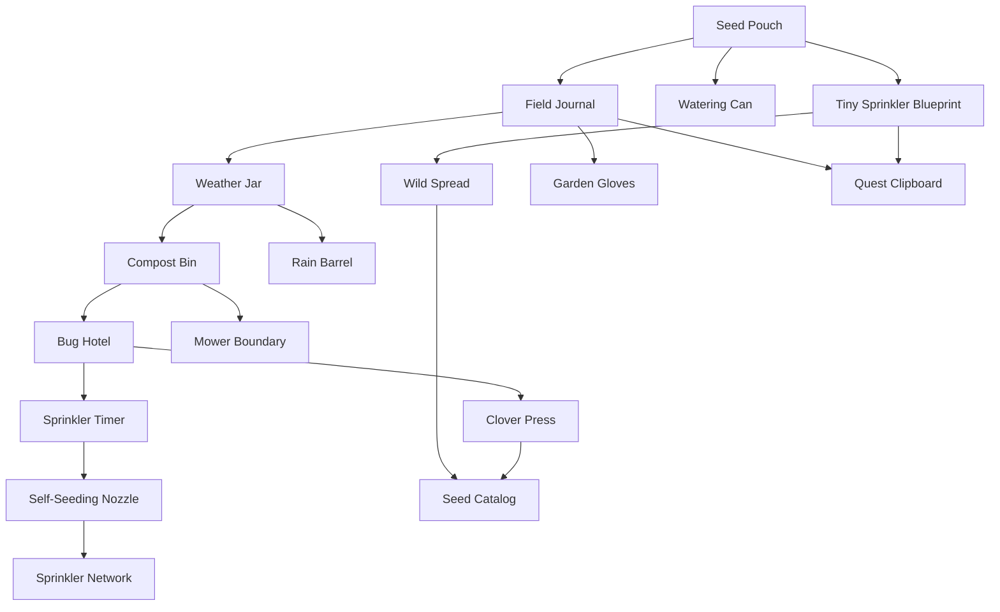
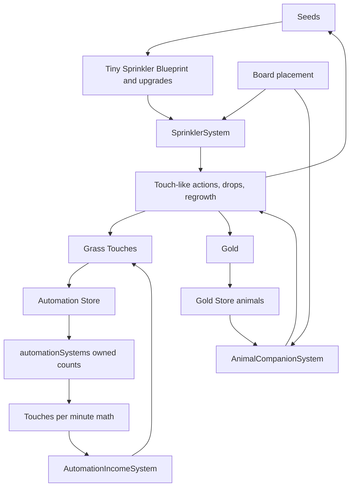
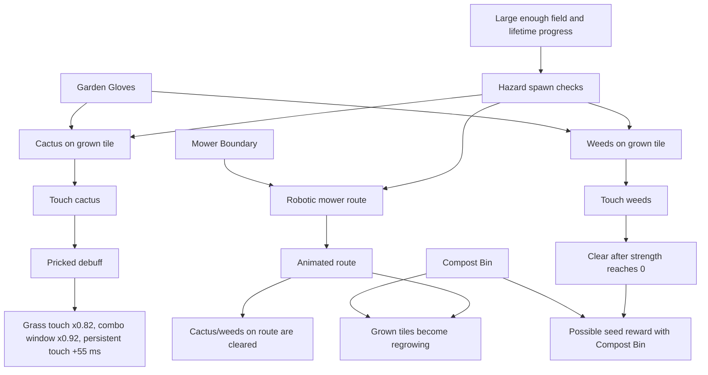

# Grass Touching Simulator Systems Reference

Current snapshot: 2026-06-20  
Primary code path: Phaser 3, TypeScript, Vite

This document explains how Grass Touching Simulator currently works as a game system. It is meant to be useful for design thinking, balancing, brainstorming, and finding coherence gaps between mechanics.

It is not a replacement for the source. When this document and code disagree, the code wins. The most important source files are listed throughout.

## One-Sentence Model

Grass Touching Simulator is an incremental field game where touching grown grass earns Grass Touches, Grass Touches buy upgrades and automation, seeds unlock systemic capabilities, gold buys consumables and placeable helpers, and the field gradually becomes a larger, stranger, more automated ecosystem.

## Design Pillars Already Present

- Manual intimacy: the core verb is still clicking or holding on individual grass patches.
- Probabilistic texture: crits, double touches, rare grass, traits, weather, drops, mutations, and hazards all give the field a shifting feel.
- Layered progression: Grass Touches, seeds, gold, upgrades, seed shop unlocks, automation, quests, journal discoveries, and prestige each push different parts of the game.
- Board locality: tiles have coordinates, neighbors matter, world objects can be placed, and some helpers prefer nearby tiles.
- Performance-conscious scale: the field can grow very large, so rendering and systems avoid touching every tile every frame.
- No offline progress: `lastSavedAt` is metadata only. The player should not receive rewards for time spent away from the game unless that design rule changes explicitly.

## Source Map

| Area | Main files |
| --- | --- |
| Main scene, input, UI, orchestration | `src/game/scenes/GameScene.ts` |
| Saved state shape | `src/game/types/game-state.ts` |
| Field, tiles, touching, regrowth, expansion | `src/game/systems/FieldSystem.ts` |
| Runtime stat calculation | `src/game/systems/UpgradeSystem.ts` |
| Skill tree definitions | `src/game/data/upgrades.ts` |
| Grass tier definitions | `src/game/data/grass-tiers.ts` |
| Seed shop definitions | `src/game/data/seed-shop.ts` |
| Gold store and inventory items | `src/game/data/gold-store.ts`, `src/game/systems/InventorySystem.ts` |
| Drops | `src/game/systems/DropSystem.ts`, `src/game/data/economy.ts` |
| Automation store and passive income | `src/game/data/automation-systems.ts`, `src/game/systems/AutomationIncomeSystem.ts` |
| Automation directives | `src/game/systems/AutomationDirectiveSystem.ts` |
| Active helper automation | `src/game/systems/SprinklerSystem.ts`, `src/game/systems/AnimalCompanionSystem.ts` |
| Automation milestones | `src/game/systems/AutomationMilestoneSystem.ts` |
| Automation progress tracking | `src/game/systems/AutomationProgressSystem.ts` |
| Placement | `src/game/systems/PlacementSystem.ts` |
| Weather and seasons | `src/game/data/weather.ts`, `src/game/data/seasons.ts` |
| Character classes | `src/game/data/character-classes.ts` |
| Mutations | `src/game/systems/MutationSystem.ts` |
| Hazards and debuffs | `src/game/systems/HazardSystem.ts` |
| Combos | `src/game/systems/ComboSystem.ts` |
| Quests | `src/game/data/quests.ts` |
| Journal flavor notes | `src/game/data/journal.ts` |
| Prestige | `src/game/systems/PrestigeSystem.ts` |
| Save migration | `src/game/systems/SaveSystem.ts` |
| Performance guidance | `docs/PERFORMANCE_NOTES.md`, `docs/PERFORMANCE_HARNESS.md` |

## High-Level Architecture

`GameScene` is the coordinator. It owns Phaser objects, panels, input, rendering, layout, feedback, and update scheduling. Most gameplay systems receive `GameState`, mutate it, and return whether anything changed. Visual effects are usually passed in as callbacks so systems do not directly depend on Phaser display objects.



## Primary Progression Loop



## Update Loop

Every frame, `GameScene.update` does the following major work:

1. Tracks frame timing for perf metrics.
2. Updates weather state.
3. Computes or retrieves cached `RuntimeStats`.
4. Updates regrowing tiles and marks freshly regrown tiles for perfect-touch windows.
5. Checks field expansion milestones.
6. Updates the combo timer and perfect-touch cue cleanup.
7. Runs persistent touch if the player is holding the left mouse button and owns the upgrade.
8. Runs the automation scheduler.
9. Flushes pending board layout and redraw work.
10. Periodically records journal discoveries and refreshes ready UI state.

The automation scheduler is intentionally staggered:

| Scheduled system | Interval | Initial delay | Role |
| --- | ---: | ---: | --- |
| Passive automation income | 250 ms | 0 ms | Converts automation TPM into banked Grass Touches. |
| Sprinkler | 250 ms | 90 ms | Active sprinkler helper actions. |
| Animal companions | 250 ms | 130 ms | Active animal helper actions. |
| Mutations | 250 ms | 170 ms | Adjacent grass tier hybrid events. |
| Hazards | 500 ms | 210 ms | Cactus, weeds, mower, debuff pruning. |
| Quest Clipboard | 9000 ms | 2600 ms | Claims up to 2 ready quests when unlocked. |

The staggered delays keep multiple systems from doing their heavier checks on the exact same frame.

## Game State Model

The save shape is `GameState` in `src/game/types/game-state.ts`. Current save version is `12`.

| Field | Meaning |
| --- | --- |
| `grassTouches` | Spendable main currency. Used for skill tree upgrades and automation systems. |
| `lifetimeGrassTouches` | Run total. Unlocks grass tiers, milestones, hazards, upgrades, automation, and prestige. |
| `totalClickedPatches` | Count of successful tile touches. Used by quests and progress context. |
| `seeds`, `lifetimeSeeds` | Seed currency and lifetime total. Seeds buy Seed Shop items. |
| `gold`, `lifetimeGold` | Gold currency and lifetime total. Gold buys consumables and animals. |
| `field` | `Record<TileKey, FieldTile>`. The board, keyed as `"x,y"`. |
| `tileHazards` | Temporary tile hazards such as cactus and weeds. |
| `debuffs` | Temporary player debuffs such as `pricked`. |
| `upgrades` | Skill tree levels by upgrade id. |
| `seedShopPurchases` | Permanent seed shop unlocks by item id. |
| `inventory` | Consumables and animals bought with gold. |
| `placedWorldObjects` | Board placements for owned world objects. |
| `reachedMilestones` | Field expansion milestones already claimed. |
| `claimedQuestIds` | Quest rewards already claimed. |
| `journal` | Discovered grass tiers, traits, weather, and best combo. |
| `activeWeatherId`, `weatherEndsAt` | Current weather effect when Weather Jar is owned. |
| `automationDirectiveId` | Current automation directive. |
| `automationStats` | Automation action, touch, supply, combo, and directive history. |
| `automationSystems` | Passive automation systems purchased with Grass Touches. |
| `prestige` | Meadow Memory, reset count, run records, and total prestiged touches. |
| `lastSavedAt` | Save metadata. Not used for offline rewards. |

## Field Tiles

A tile is a persistent patch of grass.

| Tile property | Meaning |
| --- | --- |
| `x`, `y` | Grid coordinate. |
| `grassState` | `"grown"` or `"regrowing"`. Only grown tiles can be touched for rewards. |
| `trait` | `"normal"`, `"dewy"`, or `"lush"`. |
| `tier` | Grass tier id. Determines base value, unlock stage, art, and some special effects. |
| `regrowEndsAt` | Timestamp when a regrowing tile becomes grown again. |
| `baseTouchValue` | Cached tier value. Updated when tier changes. |
| `baseRegrowMs` | Base regrow time, currently 2600 ms. |
| `fertility` | Random tile personality stat, initially 0.25 to 0.9. Helps lush chance. |
| `moisture` | Random tile personality stat, initially 0.2 to 0.85. Helps dewy chance. |

### Tile State Flow



## Touch Resolution

The normal manual touch path lives in `GameScene.handleTileClicked` and `FieldSystem.touchTile`.

Hazards intercept first. If a tile has cactus or weeds, the touch interacts with the hazard instead of awarding normal grass value.



### Touch Formula

Actual touch math:

```text
traitBonus = lush ? 1 : 0
rareBonus = tier is not normal ? stats.rareTouchBonus : 0
doubled = random < stats.doubleTouchChance

baseGained =
  floor((tier.touchValue + stats.touchMultiplier + traitBonus + rareBonus)
  * stats.grassTouchMultiplier
  * (doubled ? 2 : 1))

critChance =
  stats.critChance
  + (lush ? 0.025 : dewy ? 0.012 : 0)

isCrit = random < critChance
gained = floor(baseGained * (isCrit ? stats.critMultiplier : 1))
```

The result is clamped to at least `1`.

Then the tile becomes regrowing:

```text
regrowEndsAt = now + baseRegrowMs * stats.regrowMultiplier * optionalRegrowScale
```

If `instantRegrowChance` succeeds, the tile immediately becomes grown again, gets a newly rolled trait and tier, and is removed from the regrowing set.

### Trait Roles

| Trait | Current mechanical role |
| --- | --- |
| `normal` | Baseline. |
| `dewy` | Adds +1.2 percentage points to crit chance and +2 percentage points to seed drop chance. Helps journal collection. |
| `lush` | Adds +1 direct touch value, +2.5 percentage points to crit chance, and +4 percentage points to seed drop chance. Helps journal collection. |

Coherence note: the tile info panel currently presents dewy/lush as `+1/+2` value traits, but `touchTile` only grants a direct +1 for lush and no direct value for dewy. Decide whether the UI or the formula is the intended design.

## Regrowth

Regrowth is tracked with a cached set of regrowing tile keys, which avoids scanning the entire field every frame.

When a tile regrows:

1. `grassState` becomes `"grown"`.
2. `regrowEndsAt` resets to `0`.
3. A new trait is rolled.
4. A new grass tier is rolled from unlocked tiers.
5. The tile can enter the perfect-touch window.
6. Discoveries are recorded in the journal.

Trait roll:

```text
lushChance = 0.04 + tile.fertility * 0.04
dewyChance = stats.dewChance + tile.moisture * 0.04
```

Since initial fertility is 0.25 to 0.9, natural lush chance starts around 5.0% to 7.6%. Since initial moisture is 0.2 to 0.85, moisture contributes about 0.8% to 3.4% dewy chance before stats. `stats.dewChance` is capped at 42%.

## Grass Tiers

Grass tiers unlock by `lifetimeGrassTouches`. When a tile regrows or new field tiles are created, the tier is picked from unlocked tiers using weights. Non-normal tiers are multiplied by `stats.rareTierMultiplier`.

| Tier | Value | Unlock | Weight | Identity behavior |
| --- | ---: | ---: | ---: | --- |
| Normal Grass | 1 | 0 | 100 | Baseline. |
| Thick Grass | 3 | 150 | 18 | Higher base value. |
| Clover Grass | 7 | 500 | 10 | Higher value and small gold drop bonus. |
| Golden Grass | 15 | 1200 | 5 | Guaranteed 5 gold on touch. |
| Wildflower Grass | 24 | 2600 | 7 | 22% chance to pollinate up to 2 grown neighbors into dewy/lush. |
| Moss Grass | 38 | 5000 | 6 | Longer perfect-touch window and larger perfect-touch bonus. |
| Mushroom Grass | 62 | 9500 | 5 | 18% chance to spore up to 4 neighbors, speeding regrowth or improving traits. |
| Crystal Grass | 100 | 18000 | 4 | Crits always grant crystal gold; non-crits have 16% chance. |
| Frost Grass | 160 | 32000 | 3 | Longer perfect window, larger perfect bonus, and normal non-instant touches add 700 ms regrow time. |

### Tier Gold Modifiers

Gold drop chance starts at 0.3% plus `stats.goldDropBonus`, then adds trait, tier, crit, and lifetime bonuses before capping at 3.5%.

| Tier | Extra random gold chance | Other gold behavior |
| --- | ---: | --- |
| Normal | 0% | None. |
| Thick | 0% | None. |
| Clover | +0.15% | None. |
| Golden | +0.8% | Guaranteed +5 gold. |
| Wildflower | +0.2% | None. |
| Moss | +0.1% | None. |
| Mushroom | +0.3% | None. |
| Crystal | +0.6% | Special crystal gold event. |
| Frost | +0.4% | None. |

Crits add +0.2 percentage points to gold drop chance and guarantee +1 gold through `DropSystem`.

## Field Expansion

The field starts with one normal tile at `0,0`. It can expand through milestone rewards and Wild Spread.

Maximum field size is 2500 tiles.

Expansion is organic:

- New tiles must be adjacent to existing tiles.
- Candidates are weighted by direction, local clumping, edge distance, parent fertility, and parent moisture.
- The growth path often continues in a runner-like line, but can bend.
- New tiles roll a trait and tier using current stats.

### Expansion Milestones

| Milestone | Lifetime touches | Tiles added |
| --- | ---: | ---: |
| First Sprouts | 8 | 3 |
| Patch Spreads | 28 | 4 |
| Questionable Lawn | 75 | 6 |
| Soft Backyard Grass | 180 | 9 |
| Meadow Starts | 420 | 12 |
| Neighbor Notices | 820 | 16 |
| Serious Pasture | 1500 | 24 |
| Regional Grass Event | 3000 | 36 |
| Horizon Gets Involved | 5400 | 52 |
| Grassland Protocol | 8600 | 74 |
| Unreasonable Biome | 15000 | 104 |
| Continental Touch Zone | 26000 | 140 |
| Lawn Visible From Orbit | 46000 | 210 |
| Outside Has Won | 76000 | 300 |
| Grass Singularity | 125000 | 420 |

Wild Spread also expands the field after seed drops:

| Item state | Chance on seed drop | Tiles added |
| --- | ---: | ---: |
| Wild Spread | 16% | 1 |
| Wild Spread + Seed Catalog | 28% | 2 |

## RuntimeStats

`RuntimeStats` is the central modifier object. It is recalculated from saved state and then consumed by touches, drops, regrowth, automation, hazards, weather, and helper actions.



### Base Stats

| Stat | Base |
| --- | ---: |
| `touchMultiplier` | 0 |
| `regrowMultiplier` | 1 |
| `dewChance` | 0 |
| `critChance` | 0.05 |
| `critMultiplier` | 3 |
| `seedDropBonus` | 0 |
| `goldDropBonus` | 0 |
| `rareTierMultiplier` | 1 |
| `rareTouchBonus` | 0 |
| `doubleTouchChance` | 0 |
| `instantRegrowChance` | 0 |
| `comboWindowMultiplier` | 1 |
| `comboBonusMultiplier` | 1 |
| `grassTouchMultiplier` | 1 |
| `automationGlobalMultiplier` | 1 |
| `automationDiversityBonus` | 0 |
| `automationPairSynergyBonus` | 0 |
| each `automationSystemMultiplier` | 1 |

### Stat Caps

| Stat | Cap or clamp |
| --- | --- |
| `dewChance` | max 0.42 |
| `critChance` | max 0.28 |
| `critMultiplier` | max 5.5 |
| `seedDropBonus` | max 0.2 |
| `goldDropBonus` | max 0.025 |
| `rareTierMultiplier` | 1 to 2.8 |
| `rareTouchBonus` | max 10 |
| `doubleTouchChance` | max 0.32 |
| `instantRegrowChance` | max 0.2 |
| `comboWindowMultiplier` | 0.75 to 1.45 |
| `comboBonusMultiplier` | 0.5 to 1.7 |
| `grassTouchMultiplier` | 0.1 to 120 |
| `automationGlobalMultiplier` | 0.1 to 120 |
| `automationDiversityBonus` | 0 to 0.24 |
| `automationPairSynergyBonus` | 0 to 0.12 |
| per-system automation multiplier | 0.1 to 12 |
| `regrowMultiplier` | minimum 0.42 |

## Character Classes

The player chooses one class. The class applies a passive stat package and determines which class upgrades and class quests are relevant.

| Class | Role | Passive |
| --- | --- | --- |
| Grass Toucher | Beginner / baseline | +0.5 touch value, +0.5 percentage points seed drop chance. |
| Femboy Slim | Fighter / allrounder | +1 touch value, +1 percentage point crit chance, +1 percentage point double-touch chance. |
| Bard De Wever | Bard / combo support | +18% combo window, +8% combo bonus touches, +0.8 percentage points seed drop chance. |

Class upgrades unlock only for the chosen class:

| Class | Upgrade | Unlock lifetime | Role |
| --- | --- | ---: | --- |
| Grass Toucher | Honest Work | 900 | Simple touch and seed reliability. |
| Grass Toucher | Patient Observation | 1400 | Rare-tier odds and regrowth. |
| Femboy Slim | Slay Footwork | 900 | Crits and double touches. |
| Femboy Slim | Perfect Pose | 1400 | Scene-handled perfect touch window and reward boost. |
| Bard De Wever | Steady Tempo | 900 | Combo window and combo payout. |
| Bard De Wever | Encore Circle | 1400 | Scene-handled high-combo AOE chance. |

## Skill Tree

The skill tree is defined in `src/game/data/upgrades.ts`.

Cost formula:

```text
cost = ceil(baseCost * costGrowth^currentLevel * 2.25 * (1 + currentLevel * 0.14))
```

Every upgrade also has:

- `maxLevel`
- optional prerequisites
- optional class restriction
- an unlock condition, usually lifetime touches or a system unlock
- a visual tree position
- an `apply(stats, level)` function, unless its behavior is scene-handled

### Upgrade Table

| Upgrade | Max | Unlock | Prerequisites | Effect |
| --- | ---: | --- | --- | --- |
| Softer Grass | 20 | Always | None | +1 touch value per level. |
| Faster Regrowth | 12 | Always | Softer Grass | Regrowth 5% faster per level, multiplier floor 0.45 for this upgrade. |
| Palm Press | 8 | 35 lifetime touches | Softer Grass | +1.5 touch value per level. |
| Two-Handed Technique | 8 | 45 lifetime touches | Softer Grass | +2 percentage points double-touch chance per level. |
| Dew Appreciation | 8 | 80 lifetime touches | Palm Press | +4 percentage points dewy chance per level. |
| Warm Sunlight | 8 | 95 lifetime touches | Faster Regrowth | Regrowth 2.5% faster per level, multiplier floor 0.5 for this upgrade. |
| Fertile Soil | 10 | 110 lifetime touches | Faster Regrowth | Regrowth 3% faster per level, multiplier floor 0.48 for this upgrade. |
| Barefoot Confidence | 6 | 120 lifetime touches | Two-Handed Technique | +2 touch value per level. |
| Persistent Touch | 4 | 120 lifetime touches | Two-Handed Technique | Hold left mouse to keep touching. Repeat interval gets faster. Scene-handled. |
| Lucky Clover | 8 | 35 lifetime touches | Softer Grass | +1.5 percentage points crit chance per level. |
| Dramatic Touch | 5 | 130 lifetime touches | Lucky Clover | +0.3 crit multiplier per level. |
| Grass Identification | 8 | 170 lifetime touches | Palm Press | +0.1 rare tier multiplier per level. |
| Mindful Contact | 6 | 190 lifetime touches | Two-Handed Technique, Faster Regrowth | +2 percentage points instant regrow chance per level. |
| Morning Mist | 6 | 210 lifetime touches | Dew Appreciation | +5 percentage points dewy chance per level. |
| Sprinkler Calibration | 5 | 220 lifetime touches | Faster Regrowth | Tiny Sprinklers produce +12% automation per level. Store access now opens earlier at 120 lifetime touches or first lifetime gold. |
| Satisfying Crunch | 6 | 240 lifetime touches | Dramatic Touch | +0.6 percentage points crit chance and +1.2 percentage points seed drop per level. |
| Root Network | 6 | 280 lifetime touches | Warm Sunlight, Fertile Soil | Regrowth 2% faster and +1.2 percentage points instant regrow per level. |
| Dew Respecter | 5 | 330 lifetime touches | Morning Mist | +3 percentage points dewy chance and +1 percentage point seed drop per level. |
| Soft Meadow | 5 | 340 lifetime touches | Barefoot Confidence, Fertile Soil | +3 touch value per level. |
| Better Eyes | 6 | 380 lifetime touches | Grass Identification | +0.75 rare touch value and +0.05 rare tier multiplier per level. |
| Helper Routes | 5 | 420 lifetime touches | Grass Identification | Field Mouse Routes and Bee Hive Shifts produce +11% automation per level. |
| Weather Watching | 4 | Weather Jar and 420 lifetime touches | Dew Respecter | +1 percentage point seed drop and +0.05 rare tier multiplier per level. |
| Overreaction | 5 | 420 lifetime touches | Satisfying Crunch | +0.28 crit multiplier per level. |
| Clover Magnet | 5 | 520 lifetime touches | Better Eyes, Lucky Clover | +0.12 rare tier multiplier and +0.8 percentage points crit chance per level. |
| Perennial Patches | 5 | 560 lifetime touches | Root Network | +2.5 percentage points instant regrow chance per level. |
| Premium Pasture | 5 | 820 lifetime touches | Clover Magnet, Soft Meadow | +1.25 rare touch value and +0.15 rare tier multiplier per level. |
| Grazing Logistics | 5 | 900 lifetime touches | Soft Meadow | Earthworm, Chicken, Sheep, Rabbit automation +10% per level. |
| Ecosystem Loop | 4 | Any automation owned and 1400 lifetime touches | Sprinkler Calibration, Helper Routes, Grazing Logistics | +4% diversity automation per active system type after the first and +2% paired-system synergy per level. |
| Grassmaxxing | 3 | 1600 lifetime touches | Overreaction, Premium Pasture, Perennial Patches | +8 touch value, +1.5 percentage points crit, +1.5 percentage points seed, +0.18 rare tier multiplier per level. |
| Honest Work | 4 | Grass Toucher, 900 lifetime touches | Soft Meadow, Grass Identification | +0.75 touch value and +0.4 percentage points seed drop per level. |
| Patient Observation | 3 | Grass Toucher, 1400 lifetime touches | Honest Work | +0.08 rare tier multiplier and regrowth 2.5% faster per level. |
| Slay Footwork | 4 | Femboy Slim, 900 lifetime touches | Satisfying Crunch, Two-Handed Technique | +0.8 percentage points crit and +1.2 percentage points double-touch chance per level. |
| Perfect Pose | 3 | Femboy Slim, 1400 lifetime touches | Slay Footwork | Perfect touch window +50 ms and bonus +0.04 per level. Scene-handled. |
| Steady Tempo | 4 | Bard De Wever, 900 lifetime touches | Soft Meadow, Mindful Contact | Combo window +3% and combo bonus +2.5% per level. |
| Encore Circle | 3 | Bard De Wever, 1400 lifetime touches | Steady Tempo | High-combo AOE chance +2 percentage points per level. Scene-handled. |

## Combos, Perfect Touches, Persistent Touch, and AOE

### Combos

Combos are recorded in `ComboSystem`.

Base manual combo window: 1450 ms.

| Combo count | Multiplier |
| ---: | ---: |
| 6 | 1.12 |
| 12 | 1.22 |
| 20 | 1.35 |
| 32 | 1.5 |
| 50 | 1.7 |

Combo bonus:

```text
bonusTouches = floor(baseTouches * (comboMultiplier - 1) * stats.comboBonusMultiplier)
```

Automation touches use a longer window and lower bonus scaling:

- automation combo window: 12000 ms
- automation combo bonus scale: 0.35

### Perfect Touch

When a tile regrows, it briefly enters a perfect-touch window.

Base perfect window: 650 ms.  
Base perfect bonus: 25% of the touch value, minimum 1.

Modifiers:

| Source | Window | Bonus |
| --- | ---: | ---: |
| Soft Rain weather | window becomes 1150 ms | unchanged |
| Dewy Morning weather | window becomes 980 ms | unchanged |
| Restless Roots weather | window becomes 620 ms | unchanged |
| Moss tier | +420 ms | bonus becomes 60% |
| Frost tier | +520 ms | bonus becomes 75% |
| Perfect Pose | +50 ms per level | +0.04 per level |
| Golden Hour weather | unchanged | 4% chance to gain gold equal to 25% of the base touch |

### Persistent Touch

Persistent Touch is the hold-left-mouse upgrade.

| Value | Amount |
| --- | ---: |
| Base interval | 230 ms |
| Per-level reduction after level 1 | 28 ms |
| Minimum interval | 135 ms |
| Drag grace | 48 ms |
| Miss interval | 90 ms |
| Blocked interval | 320 ms |
| Pricked penalty | +55 ms |

Persistent touch stops when:

- a blocking overlay opens
- placement mode is active
- the player pans the board
- the pointer is no longer a valid left-mouse board touch
- a hazard touch says to stop persistent touching
- display object pressure or board layout work says the game should pause touch repetition

### Combo AOE

High manual combos can splash touches into cardinal neighboring tiles.

| Condition | Chance |
| --- | ---: |
| combo >= 18 | 12% |
| combo > 36 | 25% |
| Lucky Breeze weather | +8 percentage points |
| Bard De Wever Encore Circle | +2 percentage points per level |
| Final cap | 45% |

AOE touches use normal touch math on neighboring grown tiles, but seed and gold drop feedback uses a reduced chance scale of 0.35.

## Drops and Currencies

### Grass Touches

Grass Touches are both progression score and spendable currency.

They are spent on:

- skill tree upgrades
- automation systems

They are earned from:

- manual tile touches
- combo bonuses
- perfect-touch bonuses
- placement synergy bonus touches
- passive automation income
- active helper touches
- some quests

`GrassTouchAmount` is a number clamped between 0 and `1e300`, floored to whole numbers.

### Seeds

Seed drop chance:

```text
base = 7.5%
+ Seed Pouch 5.5%
+ Compost Bin 1.8%
+ Bug Hotel 1.2%
+ Self-Seeding Nozzle 1.0%
+ stats.seedDropBonus
+ dewy trait 2.0%
+ lush trait 4.0%
```

The base seed chance from shop/stat sources is capped at 32% before trait and chance scale are applied in `DropSystem`.

Seeds are spent in the Seed Shop, which mostly unlocks new systems, new layers of probability, and counterplay.

### Gold

Gold drop chance:

```text
base = 0.3%
+ stats.goldDropBonus
+ trait bonus
+ tier bonus
+ crit bonus
+ lifetime bonus at 900 lifetime touches
```

Then the result is multiplied by any chance scale and capped at 3.5%.

Gold is spent in the Gold Store on consumables and animals.

## Seed Shop

The Seed Shop is a permanent system unlock shop. It spends seeds.



| Item | Cost | Unlock | Effect |
| --- | ---: | --- | --- |
| Seed Pouch | 6 | Always | Improves manual seed drop chance. |
| Tiny Sprinkler Blueprint | 20 | Seed Pouch | Installs Tiny Sprinkler field behavior. Store access is handled by early lifetime touches or first lifetime gold. |
| Watering Can | 18 | Seed Pouch | Manual touches water nearby resting patches so they regrow sooner. |
| Field Journal | 28 | Seed Pouch | Enables journal collection bonuses and rare-tier support. |
| Wild Spread | 35 | Tiny Sprinkler Blueprint | Seed drops can sprout nearby new grass tiles. |
| Quest Clipboard | 54 | Field Journal and Tiny Sprinkler Blueprint | Automation claims up to 2 ready quests every 9 seconds. |
| Weather Jar | 42 | Field Journal | Unlocks rotating weather. |
| Compost Bin | 58 | Weather Jar | Improves seed drops, rare grass value, mower recovery, and weed compost rewards. |
| Garden Gloves | 76 | Field Journal and 360 lifetime touches | Cactus pricks fade sooner and new weeds usually need less pulling. |
| Bug Hotel | 80 | Compost Bin | Improves seed drops and crit chance. |
| Rain Barrel | 70 | Weather Jar | Weather lasts longer, dew chance rises, regrowth improves. |
| Mower Boundary | 135 | Compost Bin and 720 lifetime touches | Robotic mower visits less often and takes shorter routes. |
| Forager Trails | 105 | Field Mouse or Meadow Rabbit owned | Field Mouse and Meadow Rabbit act faster near their placed tiles. |
| Sprinkler Timer | 95 | Bug Hotel | Tiny Sprinkler acts more often. |
| Self-Seeding Nozzle | 115 | Sprinkler Timer | Tiny Sprinkler can find occasional seeds. |
| Sprinkler Network | 170 | Self-Seeding Nozzle | Tiny Sprinkler waters/touches more patches and reaches farther. |
| Clover Press | 120 | Bug Hotel | Rare grass and crits become more common. |
| Seed Catalog | 150 | Wild Spread and Clover Press | Wild Spread triggers more often and adds more patches. |

## Gold Store and Inventory

The Gold Store spends gold and adds entries to `inventory`. The Store opens at 120 lifetime touches or after collecting 1 lifetime gold.

| Item | Cost | Kind | Max | Unlock | Effect |
| --- | ---: | --- | ---: | --- | --- |
| Pocket Sunshine | 6 | Consumable | none | Always | Instantly regrows all resting patches and makes them dewy. |
| Seed Satchel | 8 | Consumable | none | Always | Opens into 5 seeds. |
| Field Mouse | 16 | Animal | 1 | 1 lifetime gold | Placeable scurry helper; inventory passive gives +0.1 percentage points gold drop. |
| Bee Hive | 24 | Animal | 3 | 2 lifetime gold | Placeable pollination helper. |
| Chicken | 36 | Animal | 2 | Field Mouse or Bee Hive owned | Placeable support/gold helper. |
| Sheep | 58 | Animal | 2 | Chicken owned | Placeable graze/gold helper. |
| Meadow Rabbit | 28 | Animal | 1 | Field Mouse owned | Placeable hop/seed helper; inventory passive gives +0.6 percentage points seed and dew chance. |
| Earthworm | 32 | Animal | 2 | Field Mouse or Bee Hive owned | Placeable regrowth helper. |

Consumables can be bought repeatedly. Animals have max quantities.

## Placement

World objects can be placed on field tiles. Placement is stored in `placedWorldObjects` as one tile key per object id.

Placement rules:

- A tile can hold only one world object.
- Clicking an owned world object enters placement mode.
- Clicking a valid tile places or moves that object.
- Nearby active placements affect manual touches in radius 1.

Placement synergy on manual touches:

| Nearby object | Synergy |
| --- | --- |
| Sprinkler | Regrowing touched tile can have remaining regrow time multiplied by 0.86. |
| Bee Hive | Seed chance scale +0.15 and possible nearby pollination. |
| Field Mouse | Gold chance scale +0.12. |
| Chicken | Gold chance scale +0.08, seed chance scale +0.05. |
| Sheep | 35% chance for +1 bonus touch, gold chance scale +0.06. |
| Meadow Rabbit | Seed chance scale +0.10. |
| Earthworm | Regrowing touched tile can have remaining regrow time multiplied by 0.88. |

If seed chance scale is above 1, there is also a 12% chance to pollinate a grown neighbor into dewy or lush.

## Watering Can

Watering Can is a Seed Shop item, not an inventory consumable.

On manual touch, it checks the touched tile and cardinal neighbors for regrowing patches.

| Condition | Effect |
| --- | --- |
| Origin tile is regrowing | Remaining regrow time multiplied by 0.70. |
| Neighbor tile is regrowing | Remaining regrow time multiplied by 0.78. |
| Combo >= 6 | Can water 1 extra tile. |
| Combo >= 12 | Can water another extra tile. |
| Minimum remaining time | 320 ms. |

Watered patch count is tracked for quests.

## Automation

Automation has two different layers:

1. Passive automation systems bought with Grass Touches in the Automation Store.
2. Active helper systems from sprinklers and gold-store animals, often tied to board placement.

This is important. A `Field Mouse Route` automation system and a `Field Mouse` inventory animal use similar fantasy, but they are stored and purchased differently.



### Automation Store Systems

Automation systems cost Grass Touches. Cost formula:

```text
cost = ceil(baseCost * costGrowth^owned)
```

| System | Base TPM | Base cost | Cost growth | Unlock |
| --- | ---: | ---: | ---: | --- |
| Tiny Sprinkler | 22 | 42 | 1.15 | Store access: 120 lifetime touches or 1 lifetime gold. |
| Field Mouse Route | 46 | 135 | 1.17 | 120 lifetime touches. |
| Bee Hive Shift | 82 | 275 | 1.18 | Field Journal or 240 lifetime touches. |
| Earthworm Crew | 140 | 500 | 1.19 | 420 lifetime touches. |
| Chicken Patrol | 230 | 780 | 1.20 | 700 lifetime touches. |
| Sheep Grazing Loop | 360 | 1250 | 1.21 | 1200 lifetime touches. |
| Meadow Rabbit Circuit | 560 | 1950 | 1.22 | 1900 lifetime touches. |

The Automation Store has a normal buy mode and a boost-buy mode. Boost-buy targets the next per-system milestone.

### Passive Automation Output

Core passive formula:

```text
systemTPM =
  effectiveOwned
  * baseTouchesPerMinute
  * systemMilestoneMultiplier
  * statSystemMultiplier
  * diversityMultiplier
  * pairSynergyMultiplier

totalTPM =
  sum(systemTPM)
  * stats.automationGlobalMultiplier
  * directive.touchOutputMultiplier
```

Effective owned:

```text
effectiveOwned = owned + nextSystemOwned * 0.35
```

That means later automation systems support the previous system in the store list.

Per-system milestones:

| Owned count | Multiplier |
| ---: | ---: |
| 5 | 1.6 |
| 10 | 2.8 |
| 25 | 6 |
| 50 | 11 |
| 100 | 20 |

Global automation unit milestones affect active helper cadence:

| Total automation units | Helper interval multiplier |
| ---: | ---: |
| 0-1 | 1.00 |
| 2-3 | 0.92 |
| 4-6 | 0.84 |
| 7-10 | 0.76 |
| 11+ | 0.68 |

### Automation Pair Synergies

Pair synergies are enabled by `Ecosystem Loop`, which adds:

- automation diversity bonus: +4% per level per active system type after the first
- pair synergy bonus: +2% per level per paired unit, capped at +60% per pair

| Pair | Systems |
| --- | --- |
| Bloom Cycle | Sprinkler + Bee Hive |
| Forager Circuit | Field Mouse + Meadow Rabbit |
| Soil Scratch | Earthworm + Chicken |
| Pasture Turnover | Earthworm + Sheep |
| Grazing Trail | Sheep + Meadow Rabbit |

### Automation Directives

Directives tune passive output and active helper behavior.

| Directive | Passive output | Helper interval | Helper touch | Regrow | Supply chance | Intent |
| --- | ---: | ---: | ---: | ---: | ---: | --- |
| Balanced | x1.00 | x1.00 | x1.00 +0 | x1.00 | +0 | Default mixed behavior. |
| Growth | x1.05 | x0.86 | x1.00 +0 | x0.78 | -0.01 | Faster helpers and regrowth support. |
| Harvest | x1.35 | x1.02 | x1.16 +2 | x1.02 | +0 | Better output and stronger helper touches. |
| Supplies | x1.02 | x1.00 | x1.00 +0 | x1.00 | +0.12 | More seed/gold finds from helpers. |
| Auto-Pilot | depends | chosen x0.94 | depends | depends | depends | Chooses a directive and adds x1.10 passive output. |

Auto-Pilot chooses:

- Growth if fewer than 36% of tiles are grown.
- Supplies if seeds < 12 or gold < 4.
- Harvest if enough high-value grown tiles exist.
- Balanced otherwise.

### Active Sprinkler

`SprinklerSystem` requires the Tiny Sprinkler Blueprint.

Base interval:

- 11000 ms normally
- 7000 ms with Sprinkler Timer
- multiplied by automation interval milestone
- multiplied by directive helper interval
- minimum 5000 ms

Behavior:

- Targets grown grass, or regrowing grass more often under Growth directive.
- If target is regrowing, speeds remaining regrowth by `0.58 * directiveGrowthRegrowMultiplier`.
- If target is grown, performs a touch-like action using directive-adjusted stats.
- Sprinkler Network gives 2 touches per cycle and radius 2.
- Bloom Cycle pair synergy can add another touch per cycle if pair power is at least 25%.
- Self-Seeding Nozzle lets sprinkler find seeds.
- Sprinkler can also find gold.

### Active Animal Companions

Animals come from the Gold Store inventory. Some are placeable and prefer local tiles.

| Animal | Main active behavior |
| --- | --- |
| Field Mouse | Touches local grown grass, may find gold. Faster and wider with Forager Trails. |
| Bee Hive | Improves a local cluster, turning grown tiles dewy/lush or speeding regrowing tiles. |
| Chicken | Either improves a random tile or scratches up gold. |
| Sheep | Touches a grown tile and may produce gold. |
| Meadow Rabbit | Touches local grown grass and may find seeds. Faster with Forager Trails. |
| Earthworm | Speeds regrowth on resting patches. |

Directive and pair synergy affect their intervals, target choices, and supply odds.

## Weather

Weather is unlocked by Weather Jar. The active weather rotates when its timer ends:

- 120 seconds by default
- 150 seconds with Rain Barrel

`pickWeather` avoids repeating the immediately previous weather.

| Weather | Effect |
| --- | --- |
| Calm Skies | No special modifier. |
| Dewy Morning | +14 percentage points dewy chance, +3 percentage points seed drop. |
| Warm Sunlight | Regrowth x0.85. |
| Lucky Breeze | +8 percentage points crit chance, +0.25 rare tier multiplier. |
| Seed Wind | +8 percentage points seed drop. |
| Soft Rain | Regrowth x0.82, +10 percentage points dewy chance. |
| Pollinator Swarm | +4.5 percentage points seed drop, +5.5 percentage points crit chance. |
| Golden Hour | +0.38 rare tier multiplier, +2 rare touch value, +0.6 percentage points gold drop. |
| Restless Roots | +8 percentage points instant regrow, regrowth x0.92. |

Some weather also has scene-specific behavior:

- Soft Rain, Dewy Morning, and Restless Roots change perfect-touch windows.
- Lucky Breeze increases combo AOE chance.
- Golden Hour can add gold to perfect touches.

## Seasons

Seasons are based on the real-world month, not saved state.

| Season | Months | Effect |
| --- | --- | --- |
| Spring | March, April, May | +4.5 percentage points dew chance, +1.5 percentage points seed drop. |
| Summer | June, July, August | Regrowth x0.95, +0.12 rare tier multiplier. |
| Autumn | September, October, November | +2.5 percentage points seed drop, +1.2 percentage points crit chance. |
| Winter | December, January, February | Regrowth x1.08, +1 touch value. |

## Journal

Field Journal starts as saved discovery state, but its bonuses only activate after buying the Field Journal item.

Tracked discoveries:

- grass tiers discovered
- tile traits discovered
- weather types seen
- best combo count

Collection bonuses:

| Collection | Bonus |
| --- | --- |
| Each discovered grass tier | +0.025 rare tier multiplier and +0.25 rare touch value. |
| All grass tiers | Additional +0.15 rare tier multiplier and +2 rare touch value. |
| Each discovered trait | +0.4 percentage points seed drop. |
| All traits | Additional +1 percentage point seed drop and +2 percentage points double-touch chance. |
| Each seen weather after the first | +3% automation global multiplier, up to +18%. |
| All weather | Additional +12% automation global multiplier. |

The Field Journal item also gives a flat +0.1 rare tier multiplier.

Journal discoveries happen through:

- touching or regrowing tiles
- Wild Spread and other tile creation
- active weather changes
- periodic scene refreshes
- mutation event records

## Quests

Quests are defined in `src/game/data/quests.ts`. Each quest has:

- id
- category
- name and description
- reward
- optional class restriction
- optional prerequisite quest ids
- completion function
- progress formatter

Availability depends on class and prerequisite quests being claimed. A quest can be complete but unavailable if its prerequisite reward has not been claimed yet.

Quest rewards can give:

- Grass Touches
- seeds
- gold

Quest categories currently include:

| Category | What it tracks |
| --- | --- |
| Touching | Lifetime Grass Touch thresholds. |
| Field | Field tile count. |
| Milestones | Expansion milestones reached. |
| Economy | Lifetime seeds and gold. |
| Seed Shop | Specific Seed Shop purchases and counts. |
| Automation | Placement, automation actions, automated touches, supply drops, system types, milestones, directives, pair synergies. |
| Field Journal | Grass specimen discovery and hybrid mutation events. |
| Skill Tree | Upgrade levels and path starts. |
| Class | Class-specific upgrade goals. |
| Weather | Weather Watching and Rain Barrel. |

Quest Clipboard:

- unlocked in Seed Shop
- runs every 9 seconds
- claims up to 2 ready quest rewards

## Mutations

`MutationSystem` creates occasional hybrid events between adjacent grown grass tiers.

Timing:

- checks every 8200 ms
- samples up to 72 grown tiles
- per matching pair chance is 36%

Only cardinal neighbors count.

| Mutation | Tier pair | Effect |
| --- | --- | --- |
| Clover Weave | Thick + Clover | Up to 3 changed tiles become dewy/lush, +1 seed. |
| Lucky Bloom | Golden + Clover or Wildflower | Up to 3 changed tiles become lush/dewy, +1 gold. |
| Moss Spores | Moss + Mushroom | Up to 4 changed tiles become dewy/lush. |
| Prismatic Frost | Crystal + Frost | Up to 2 changed tiles become lush/dewy, +1 seed and +1 gold. |

Mutation count is stored in `state.mutationEvents` and used by Field Journal quests.

## Hazards and Debuffs

Hazards are negative or pressure mechanics. They live in `tileHazards` and are controlled by `HazardSystem`.



### Cactus

| Value | Amount |
| --- | ---: |
| Unlock lifetime touches | 180 |
| Minimum field tiles | 8 |
| Check interval | 9000 ms |
| Spawn chance per check | 26% |
| Duration | 22000 to 36000 ms |
| Spawn attempts | 18 |
| Default pricked duration | 8500 ms |
| Garden Gloves pricked duration | 5200 ms |

Cactus rules:

- Spawns only on grown, non-hazard tiles.
- Touching cactus removes it and applies `pricked`.
- Touching cactus stops persistent touch.
- Pricked applies in `getRuntimeStats`: grass touch multiplier x0.82 and combo window x0.92.
- Persistent touch also adds +55 ms interval while pricked.

Cactus cap by field size:

| Field tiles | Cap |
| ---: | ---: |
| below 70 | 1 |
| 70 to 319 | 2 |
| 320 to 899 | 3 |
| 900+ | 4 |

### Weeds

| Value | Amount |
| --- | ---: |
| Unlock lifetime touches | 360 |
| Minimum field tiles | 16 |
| Check interval | 12000 ms |
| Spawn chance per check | 22% |
| Spread chance per check | 16% |
| Duration | 42000 to 70000 ms |
| Spawn attempts | 18 |

Weed rules:

- Spawns only on grown, non-hazard tiles.
- Can spread from existing weeds to cardinal grown neighbors.
- Has `strength`, usually 1 or 2.
- Each touch reduces strength by 1.
- Touching weeds stops persistent touch.
- Garden Gloves makes new weeds usually strength 1.
- Compost Bin changes clear text to composting and gives a 38% chance for +1 seed when cleared.

Weed cap by field size:

| Field tiles | Cap |
| ---: | ---: |
| below 90 | 2 |
| 90 to 319 | 3 |
| 320 to 899 | 4 |
| 900+ | 5 |

### Robotic Lawnmower

| Value | Amount |
| --- | ---: |
| Unlock lifetime touches | 720 |
| Minimum field tiles | 28 |
| Interval | 78000 to 122000 ms |
| Mower Boundary interval multiplier | x1.35 |
| Minimum route length | 4 tiles |
| Maximum route length | 14 tiles |
| Mower Boundary max route length | 9 tiles |
| Route attempts | 18 |

Mower rules:

- Creates a horizontal or vertical route through existing field tiles.
- If straight route generation fails, it uses a fallback walking route.
- The scene animates one mower sprite along the route.
- Each crossed grown tile becomes regrowing.
- Regrow scale is 1.16 by default, meaning mown grass regrows slower.
- With Compost Bin, regrow scale is 0.92, turning mower recovery into a small benefit.
- Cactus and weeds on the route are cleared.

## Prestige

Prestige unlocks at 25,000 lifetime Grass Touches in the current run.

Memory gain:

```text
if runTouches < 25000:
  memoryGain = 0
else:
  ratio = max(1, runTouches / 25000)
  memoryGain = min(5000, max(5, floor(5 * ratio^0.42)))
```

Production multiplier:

```text
1 + meadowMemory * 0.18 + sqrt(meadowMemory) * 0.08 + resets * 0.12
```

Prestige reset:

- creates a fresh initial state for the same character class
- applies the next prestige state
- keeps journal discoveries and best combo
- keeps selected music track
- resets run currencies, field, upgrades, seed shop, inventory, automation, hazards, etc.

Prestige multiplier affects:

- `grassTouchMultiplier`
- `automationGlobalMultiplier`

## Save System

Saves are localStorage-backed. The key is still:

```text
grass-touching-simulator.save.v1
```

Schema versioning is handled by `CURRENT_SAVE_VERSION`, not the key name.

Save rules:

- New persistent fields must be added to `GameState`.
- `createInitialState` must define defaults.
- `SaveSystem` must migrate or default missing values.
- `CURRENT_SAVE_VERSION` should increase for schema changes.
- Saves are queued or deferred during active layout, panning, redraw work, or shutdown-sensitive paths.
- `lastSavedAt` is metadata only.

## Performance Model

Performance is a first-class design constraint, especially on phones and tablets.

Important current safeguards:

- Regrowing tiles are tracked by a cached key set.
- Field tile arrays are cached per `GameState`.
- Large fields use batched/common rendering instead of live display objects for every tile.
- Live tile views are limited to small fields; `LIVE_TILE_VIEW_FIELD_LIMIT` is 180.
- Tile culling uses a viewport margin.
- Dirty tile overlays avoid redrawing the whole board for ordinary changes.
- Display object pressure starts at 850 objects and critical pressure at 1150.
- Persistent touch pauses under layout or display-object pressure.
- Regrow visual feedback is throttled to 6 per batch every 240 ms.
- Automation touch visuals are credit-based and suppressed when the board is busy.
- The perf harness reports visible tiles, layout passes, redraws, frame spikes, display objects, active tweens, and hotspots.

Required check for performance-sensitive changes:

```sh
npm run build
```

Recommended browser harness:

```text
http://127.0.0.1:5173/?perfHarness&tiles=1200
```

Read:

```js
document.documentElement.dataset.grassPerfHarness
```

## System Coherence Map

This map groups systems by the design job they perform.

| Design job | Systems |
| --- | --- |
| Core action | Manual touch, persistent touch, perfect touch, combo, AOE. |
| Board recovery | Regrowth, instant regrow, Watering Can, Sprinkler, Earthworm, weather. |
| Value growth | Grass tiers, touch upgrades, crit upgrades, rare-touch upgrades, prestige. |
| Field growth | Milestones, Wild Spread, Seed Catalog. |
| Probability texture | Traits, crits, double touch, rare tiers, drops, weather, seasons, mutations. |
| System unlocks | Seed Shop, skill tree prerequisites, automation unlocks. |
| Alternative currencies | Seeds and gold. |
| Automation | Passive automation systems, directives, helper actions, milestones, pair synergies. |
| Collection | Journal specimens, weather seen, companion notes, collection bonuses. |
| Goal structure | Quests, Quest Clipboard, class quests. |
| Board locality | Tile coordinates, neighbors, placement, mutations, hazards, mower routes. |
| Pressure and counterplay | Cactus, weeds, mower, Pricked, Garden Gloves, Compost Bin, Mower Boundary. |
| Long-term reset | Prestige and Meadow Memory. |

## Current Coherence Notes

These are not necessarily bugs. They are places where the system fantasy, UI, or balance could be clarified.

### 1. Trait Value Mismatch

The tile info panel says dewy and lush add direct value, but the touch formula only gives lush a direct +1 and gives dewy no direct touch value. Pick one identity:

- dewy/lush are direct value tiers: update `touchTile`
- dewy/lush are probability traits: update UI copy
- dewy is utility and lush is value: make the UI say that explicitly

### 2. Automation Has Two Parallel Fantasies

There are passive automation systems bought with Grass Touches and active/placeable animals bought with gold. Some names overlap, especially Field Mouse, Bee Hive, Sheep, Earthworm, and Meadow Rabbit.

This can be coherent if framed as:

- automation systems are contracts, routes, shifts, or crews
- gold-store animals are individual companions placed on the board

The UI and quest text should preserve that distinction.

### 3. Sprinkler Has Three Meanings

Sprinkler currently appears as:

- a Seed Shop blueprint
- a passive Automation Store system
- an active/placeable helper with radius behavior

That can work, but it needs clear naming. One possible frame is:

- blueprint: installs the active field sprinkler behavior
- automation store: number of sprinkler units producing passive income, available when the Store opens
- placed sprinkler: the field anchor for active water behavior

The active `SprinklerSystem` checks the Seed Shop blueprint, not the Automation Store owned count. Store access and passive Tiny Sprinkler purchases open earlier at 120 lifetime touches or first lifetime gold, while Sprinkler Calibration boosts sprinkler automation after it is purchased.

### 4. Passive Automation Action Counting May Need Audit

`AutomationIncomeSystem.update` records an automation action and then calls `recordAutomationTouch`, which also records an automation action. That means passive income ticks that produce touches may count as two automated actions. This may be intentional pacing for action quests, but it is worth deciding explicitly.

### 5. Seeds Are Mostly Unlocks, Gold Is Mostly Tangible Help

Seeds buy rules. Gold buys things. This is a strong identity split:

- seeds: knowledge, systems, tools, progression switches
- gold: consumables, companions, field objects

Future items should probably respect that split unless intentionally subverting it.

### 6. Hazards Need Reward Texture

Cactus is pure punishment plus removal. Weeds become mildly rewarding through Compost Bin. Mower can be bad, neutral, or slightly helpful depending on Compost Bin and route hazard-clearing.

Possible future direction:

- cactus could occasionally leave a seed when cleared with Garden Gloves
- weeds could feed mutation or compost mechanics
- mower could create a "freshly cut" trait if the player has the right counter-item

### 7. Weather and Seasons Both Modify Global Probability

Weather is player-unlocked and rotating. Seasons are real-date ambient modifiers. The two systems have similar stat vocabulary, so their identities should stay distinct:

- weather: active field mood, visible, temporary, collectible in journal
- season: slow ambient backdrop, date-based, not something the player controls

### 8. Perfect Touch Is a Strong Skill-Expression Hook

Perfect touch ties together regrowth, attention, weather, class identity, and rare tiers. It is a good candidate for future mechanics because it rewards paying attention to the field instead of only buying passive multipliers.

### 9. Field Locality Is Underused But Promising

Placement, mutations, mower routes, weeds spread, and tier identity effects all care about neighbors or coordinates. This gives the game a tactical board layer without making it a puzzle game.

Future systems can build on locality by asking:

- What does this mechanic do near a placed object?
- Does it care about neighbors?
- Does it leave a temporary tile state?
- Does it interact with hazards?

## Future Brainstorming Hooks

These are system spaces that already have support in the current architecture.

| Space | Why it fits |
| --- | --- |
| More temporary tile states | Hazards, perfect cues, regrowth, and traits already make tiles feel stateful. |
| Counter-hazard items | Garden Gloves, Compost Bin, and Mower Boundary establish the pattern. |
| More placeable tools | Placement and radius synergy already exist. |
| More tier identity effects | Wildflower, Mushroom, Crystal, and Frost prove tiers can do more than add value. |
| Quest chains for pressure systems | Quests already track many state counters, but not hazards yet. |
| Journal entries for hazards | Journal already records specimens, traits, weather, and companions. |
| Weather-hazard interactions | Weather already mutates stats and scene behavior. |
| Automation directive expansion | Directives already tune output, helper cadence, regrowth, and supplies. |
| Prestige tracks | Prestige currently has one currency and one multiplier formula. |

## Glossary

| Term | Meaning |
| --- | --- |
| Grass Touches | Main currency and production score. |
| Lifetime Grass Touches | Run total used for unlocks, milestones, and prestige. |
| Seeds | Unlock currency for Seed Shop systems and tools. |
| Gold | Tangible item currency for consumables and animals. |
| Grown tile | A tile ready to touch. |
| Regrowing tile | A tile temporarily unavailable after being touched, mown, or grazed. |
| Trait | Tile modifier: normal, dewy, or lush. |
| Tier | Grass species/value class: normal through frost. |
| RuntimeStats | The calculated stat object used by gameplay systems. |
| Seed Shop | Permanent unlock shop that spends seeds. |
| Gold Store | Inventory shop that spends gold. |
| Automation system | Passive Grass Touch production bought with Grass Touches. |
| Companion | Gold-store animal inventory item, often placeable. |
| Directive | Automation behavior mode. |
| Pair synergy | Ecosystem Loop synergy between two automation systems. |
| Perfect touch | Bonus for touching a tile shortly after it regrows. |
| Hazard | Temporary negative tile state such as cactus or weeds. |
| Debuff | Temporary player-level negative state such as Pricked. |
| Meadow Memory | Prestige currency that increases production multipliers. |
